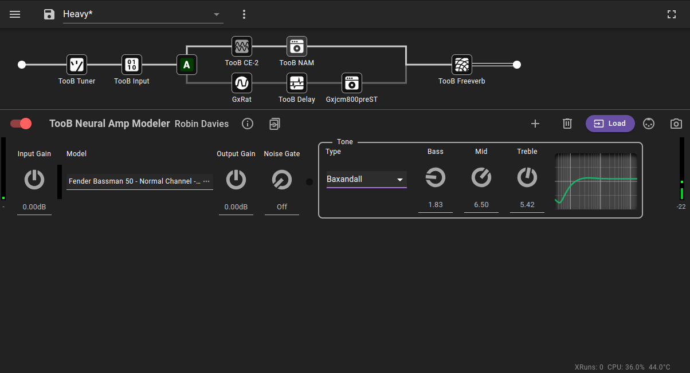
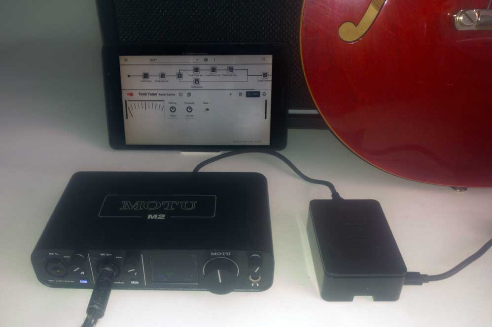
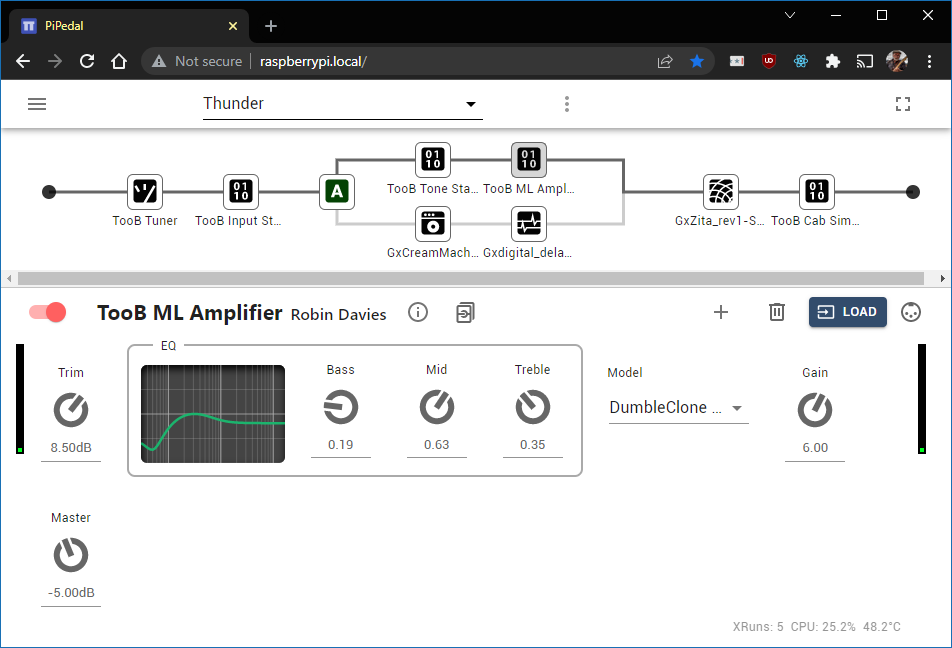
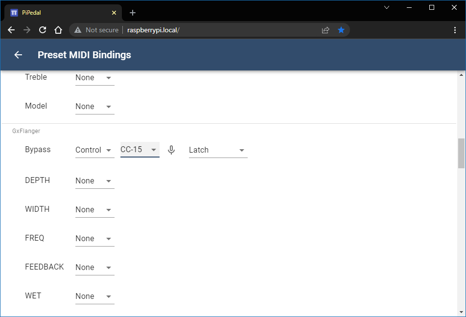

 

Download:&nbsp;<a href='https://rerdavies.github.io/pipedal/download.html'>v1.5.90</a> 
Website:&nbsp;[https://rerdavies.github.io/pipedal](https://rerdavies.github.io/pipedal).
Documentation:&nbsp;[https://rerdavies.github.io/pipedal/Documentation.html](https://rerdavies.github.io/pipedal/Documentation.html).

#### NEW version 1.5.90 Release. See the [release notes](https://rerdavies.github.io/pipedal/ReleaseNotes) for details. New Phaser and Graphic Equalizer plugins.

&nbsp;

Use your Raspberry Pi as a guitar effects pedal. Configure and control PiPedal with your phone or tablet.
PiPedal running on a Raspberry Pi 4 or Pi 5 provides stable super-low-latency audio via external USB audio devices, or internal Raspberry Pi audio hats. 

PiPedal will also run on Ubuntu 24.04,  24.10, or 25.04 (amd64/x64 or aarch64). Make sure you follow the [Ubuntu post-install instructions](https://rerdavies.github.io/pipedal/Configuring.html) to make sure your Ubuntu OS is using a  realtime-capable kernel.

PiPedal's user interface has been specifically designed to work well on small form-factor touch devices like phones or tablets. Clip a phone or tablet on your microphone stand on stage, and you're ready to play! Or connect via a desktop browser, for a slightly more luxurious experience. The PiPedal user-interface adapts to the screen size and orientation of your device, providing easy control of your guitar effects across a broad variety devices and screen sizes.

Install the [PiPedal Remote Android app](https://play.google.com/store/apps/details?id=com.twoplay.pipedal) to get one-click access to PiPedal via Wi-Fi or via the PiPedal Wi-Fi hotspot. Or connect from PC or Laptop via a web browser. PiPedal provides a simple configuration tool that allows you to set up the PiPedal's Wi-Fi hotspot access point on your Raspberry Pi.

PiPedal includes a pre-installed selection of LV2 plugins from the ToobAmp collection of plugins; but it works with most LV2 Audio plugins. There are literally hundreds of free high-quality LV2 audio plugins that will work with PiPedal. Just install them on your Raspberry Pi, and they will show up in PiPedal.  

If your USB audio adapter has MIDI connectors, you can use MIDI devices (keyboards, controllers, or midi floor boards) to control PiPedal while performing. A simple interface allows you to select how you would like to bind PiPedal controls to midi messages. 

</img>

</img>  </img> </img> </img> </img>  

 

https://github.com/user-attachments/assets/9a9fd0c6-78fc-4284-8b44-6a1929c00cc6

----
&nbsp;

### [What PiPedal Is](https://rerdavies.github.io/pipedal/AboutPiPedal.html)
### [System Requirements](https://rerdavies.github.io/pipedal/SystemRequirements.html)
### [Installing PiPedal](https://rerdavies.github.io/pipedal/Installing.html)
### [PiPedal on Ubuntu](https://rerdavies.github.io/pipedal/Ubuntu.html)

### [Headless Operation](https://rerdavies.github.io/pipedal/HeadlessOperation.html)
### [Configuring PiPedal After Installation](https://rerdavies.github.io/pipedal/Configuring.html)

&nbsp;
### [Using TooB Neural Amp Modeler](https://rerdavies.github.io/pipedal/UsingNAM.html)
### [An Intro to Snapshots](https://rerdavies.github.io/pipedal/Snapshots.html)
### [Choosing a USB Audio Adapter](https://rerdavies.github.io/pipedal/ChoosingAUsbAudioAdapter.html)
### [Optimizing Audio Latency](https://rerdavies.github.io/pipedal/AudioLatency.html)
### [Command-Line Configuration of PiPedal](https://rerdavies.github.io/pipedal/CommandLine.html)
### [Changing the Web Server Port](https://rerdavies.github.io/pipedal/ChangingTheWebServerPort.html)

&nbsp;

### [Using LV2 Audio Plugins](https://rerdavies.github.io/pipedal/UsingLv2Plugins.md)
### [Which LV2 Plugins does PiPedal support?](https://rerdavies.github.io/pipedal/WhichLv2PluginsAreSupported.html)
### [Support for LV2 Plugins with MOD User Interfaces](https://rerdavies.github.io/pipedal/ModUiSupport.html)

&nbsp;

### [Frequently Asked Questions](https://rerdavies.github.io/pipedal/FAQ.html)

&nbsp;

### [Building PiPedal from Source](https://rerdavies.github.io/pipedal/BuildingPiPedalFromSource.html)
### [Build Prerequisites](https://rerdavies.github.io/pipedal/BuildPrerequisites.html)
### [The Build System](https://rerdavies.github.io/pipedal/TheBuildSystem.html)
### [How to Debug PiPedal](https://rerdavies.github.io/pipedal/Debugging.html)

 &nbsp;

#### [PiPedal Architecture](https://rerdavies.github.io/pipedal/Architecture.html)
 

