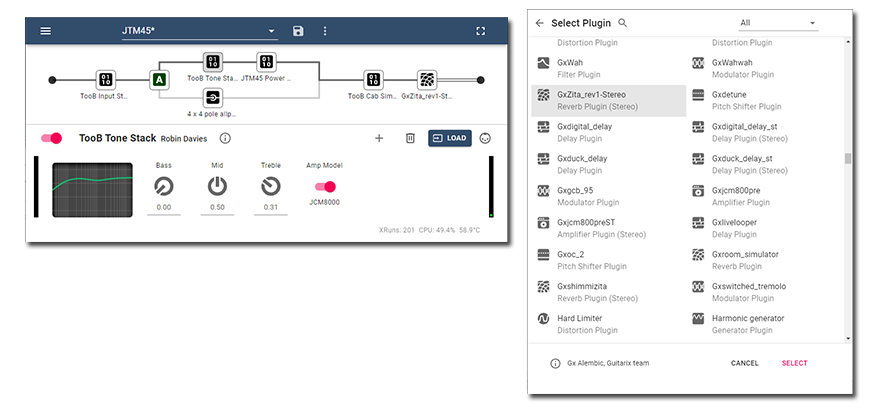

v0.1.0-alpha.1

Use your Raspberry Pi as a guitar effects pedal. PiPedal allows you to control and configure your guitar effects via a web interface, using your phone, tablet, or computer. 

PiPedal running on a Raspberry Pi 4 provides stable super-low-latency audio via external USB audio devices, or internal Raspberry Pi audio hats.

PiPedal's user interface has been specifically designed to work well on small form-factor touch devices like phones or tablets. Clip a phone or tablet on your microphone stand on stage, and you're ready to play! Or connect via a desktop browser, for a slightly more luxurious experience. The PiPedal user-interface adapts to the screen size and orientation of your device, providing easy control of your guitar effects across a broad variety devices and screen sizes.

PiPedal provides a simple configuration tool that allows you to easily set up a WiFi hotspot on your Raspberry Pi which can then be used to connect wirelessly.

PiPedal provides a pre-installed selection of plugins from the ToobAmp and Guitarix collection of plugins. But it works with most LV2 Audio plugins. There are literally hundreds of free high-quality LV2 audio plugins that will work with PiPedal.  

If your USB audio adapter has midi connectors, you can use midi devices (keyboards or midi floor boards) to control PiPedal while performing. A simple interface allows you to select how you want bind PiPedal controls to midi messages. 

### 
### 
### 
### 
### 
### 
### 
### 

### 
### 
### 
### 

## Choosing a USB Audio Adapter

The qualitty of the audio adapter dramatically affects the quality of the guitar effects. Amp models are particularly sensitive to poor signal-to-noise ratios, because overdrive effects boost the level of noise more than the level of the actual signal. For best results, you should choose a 24-bit audio adapter that provides at leat 105db (A-weighted) signal-to-noise ratio. I personally use and recommend the Motu M2 USB audio adapter, although there are plenty of other pro-quality audio adapters that will work as well. I would urge you to avoid cheaper USB audio adapters that sell for less than US$70, which will almost certainly not provide input signals of sufficient quality.

Ideally, you want a USB adatper that provides an input volume knob. For best results, you want the input signal to be as high as possible without clipping. (Clipped input signals sound horrible). USB audio adapters withouth volume knobs usually do provide internal input volume controls, which have to be set using custom software. PiPedal does not currently allow you to set the internal trim levels of USB audio adapters. By default, these adapters will expect line level-signals. But instrument levels are about 40db quieter than line-level signals; so you will not get good results if you don't adjust the input signal trim levels of your audio adapter. 

Pay close attention to the input VU meter of the first effect in your guitar effect chain. That will indicate the signal level coming into the USB adapter. Ideally, you want the value peaking solidly in the yellow range of the VU meter, and NEVER going red.

Again, the MOTU M2 excels in this regard. It provides large, volume knobs for input and output, along with very readable VU meters which indicate both input and output signal levels. 

## Configuring PiPedal After Installation

After PiPedal is installed, you can connect to the web interface as follows: via the mDNS address "http://pipedal.local" (on Windows, Mac, or iPhone web 
browsers), at http://127.0.0.1 if you are interactively logged into your Raspberry Pi device, or at port 80 of the current network address of your 
Raspberry Pi, if you are connected from an Android device (which does not currently support mDNS). 

Android devices do not support mDNS. If you are connecting to PiPedal with an Android device, via the Host Access Point, PiPedal, the PiPedal user interace can be reached at http://172.22.1.1 If you are connecting via the Raspberry Pi's Ethernet port, connect to http://*address of your Pi*:80

To complete the initial configuration, you must either connect an Ethernet cable to your Raspberry pi so you can connect to the Web App (after which you should be able to connect to http://pipedal.local); or you must launch a web browser on your Raspberry pi device while logged in interactively. 
     
If you already have another web server on port 80, see the section "Changing the Web Server Port", below.

Once connected, select the Settings menu item on the Hamburger menu at the top left corner of the display. Click on Audio Device Settings to select and configure the audio device you want to use. 

You can also activate PiPedal's Wi-Fi hotspot connection from the Settings dialog. Click on the Wifi Hotspot menu item in the Settings dialog.

     IMPORTANT NOTE: Activating the WiFi hotspot will DISABLE outbound Wi-Fi connections from the Raspberry Pi.
     You will be able to access the PiPedal web interface through the hotspot connection, and make ssh and VNC 
     connections to the Raspberry Pi through the hotspot connection; but your Raspberry Pi will not have 
     outbound access to the Internet, unless an Ethernet cable is connected to the Raspberry Pi.

If you need access to the internet once the hotspot has been enabled, connect an Ethernet cable to
the Raspberry Pi. Note that the PiPedal hotspot is NOT configured to forward internet traffic from the Wi-Fi hotspot to the LAN connection, and 
generally, the Raspberry Pi will not be able to access the internet via devices connected to the Wi-Fi hotspot. Consult documentation for hostapd 
if you want to do this.

There are a number of other useful settings in the hamburger menu/Settings dialog. For example, most USB audio devices route instrument
input onto the right channel of the USB audio inputs. So you probably want to configure PiPedal to use only the right USB audio input channel. 
You can choose how to bind USB audio input and output channels (stereo, left only, right only) in the settings dialog. If you are using a Audio 
device that has more than two channels, you will be offered a list of channels to choose from instead.

## Latency

Note that Pipedal is not intended for use when logged in to Raspbian. Screen updates and heavy filesystem activity will cause audio dropouts. For best results, access PiPedal using the web interface remotely, through the Wi-Fi hotspot. Accessing the web interface via Wi-Fi has little or no effect on audio latency or dropouts.

With a good USB audio device, PiPedal should be able to provide stable audio with 4ms (good), or 2ms (excellent) latency on a Raspberry Pi 4 when running on a stock PREEMPT kernel. Your actual results may vary.

The current Linux kernel provides best latency on USB audio devices when they are configured with a sampling rate of 48kHz, and 3 buffers. Cheap USB audio devices (e.g. M-Audio  M-Track Solo, available for less than $60) should be able to run without dropouts at 48kHz with 3x64 sample buffers. Most devices in this class use the same Burr-Brown chipset. Premium USB Audio devices should run stably at 48kHZ 3x32 sample buffers (about 2ms latency). I personally use the MOTU M2 USB audio adapter, which I highly recommmend -- stable, quiet, low-latency, great controls, and built like a tank).

Make sure your system is fully updated, and that you are running with a kernel version of 5.10 or later, since version 5.10 of the Linux kernel provides improved support for class-compliant USB audio. The MOTU M2 (and many other USB audio adapters) will not work on versions of the kernel prior to 5.10.

Prefer 64-bit operating systems to 32-bit operating systems. ARM processors execute 64-bit code about 40% faster than 32-bit code providing the same functionality.

RT_PREEMPT realtime kernels (when available) are preferred but not required. (As if Februrary 2022, there aren't any good sources for latest versions of Ubuntu or Rasbian). PiPedal provides better (but not dramatically better) latency when running on a Raspbian Realtime kernel. Stock Raspbian provides PREEMPT real-time scheduling, but does not currently have all of the realtime patches, so interrupt latency is slightly more variable on stock Rasbian than on custom builds of Raspbian with RT_PREEMPT patches applied.

The Ubuntu Studio installer will install a realtime kernel if there is one avialable. But -- at least for Ubuntu 21.04 -- there is no stock RT_PREEMPT kernel for ARM aarch64.

On a Raspberry Pi 4 device, Wi-Fi, USB 2.0, USB 3.0 and SDCARD access are performed over separate buses (which is not true for previous versions of Raspberry Pi). It's therefore a good idea to ensure that your USB audio device is either the only device connected to the USB 2.0 ports, or the only device connected to the UBS 3.0 ports. There's no significant advantage to using USB 3.0 over USB 2.0 for USB audio. Network traffic does not seem to adversely affect USB audio operations on Raspberry Pi 4 (which isn't true on previous versions of Raspberry Pi). Filesystem activity does affect USB audio operation on Rasbian, even with an RT_PREEMPT kernel; but interestingly, filesystem activity has much less effect on UBS audio on Ubuntu 21.04, even on a plain PREEMPT kernel. 

There is some reason to beleive that there are outstanding issues with the Broadcom 2711 PCI Express bus drivers on Rasbian realtime kernels, but as of September 2021, this is still a research issue. If you are brave, there is strong annecdotal evidence that these issues arise when the Pi 4 PCI-express bus goes into and out of power-saving mode, which can be prevented by building a realtime kernel with all power-saving options disabled. But this is currently unconfirmed speculation. And building realtime kernels is well outside the scope of this document. (source: a youtube video on horrendously difficult bugs encountered while supporting RT_PREEMPT, by one of the RT_PREEMPT team members).

For the meantime, for best results, log off from your Raspberry Pi, and use the web interface only.

You may also want to watch out for temperature throttling of the CPUs. PiPedal displays the current CPU temperature in the bottom-right corner of the display. The system will reduce CPU speed in order prevent damage to the system if the CPU temperature goes above 70C (perhaps above 60C). The Pi 400 already has good heat sinks, so you shouldn't run into problems when running on a Pi 400. If you run into throttling problems on a Raspberry Pi 4, you may want to buy and install a heat sink (ridiculously cheap), or install a cooling fan. As a temporary work-around, you can orient the Raspberry Pi 4 board vertically, which can provide a real and meaningful reduction in CPU temperature.

## Command Line Configuration of PiPedal

The pipedalconfig program can be used to modify configuration of PiPedal from a shell command line. Run 'pipedalconfig --help' to view
available configuration commands, some of which are not avaialbe from the web interface. For example, you can change the port number
of the Web App HTTP server if you need to, using pipedalconfig.
     
Things you can do with pipedalconfig:
     
     - Stop, start or restart the PiPedal services.
     
     - Choose whether to automatically start PiPedal services on reboot.
     
     - Select an alternate web server port.
     
     - enable or disable the Wi-Fi hotspot.
     
Run `pipedalconfig --help` for available options.
     

## Changing the web server port.
     
If your Pi already has a web server on port 80, you can reconfigure PiPedal to use a different port. After installing PiPedal, run the following command on your Raspberry Pi:
     
     sudo pipedalconfig --install --port 81
     
You can optionally restrict the addresses on which PiPedal will respond by providing an explicit IP address. For example, to configure PiPedal to only accept connections from the local host:
     
     sudo pipedalconfig --install --port 127.0.0.1:80
     
To configure PiPedal to only accept connections on the Wi-Fi host access point:
     
     sudo pipedalconfig --install --port 172.22.1.1:80

## LV2 PLugins

PiPedal uses standard LV2 audio plugins for effects. There's a huge variety of LV2 guitar effect plugins, and plugins collections, many 
of which are specifically intended for use as guitar effect plugins. Ubuntu Studio comes with an enormous collection of LV2 plugins preinstalled. On Rasbian, you will have to manually select and install the plugins you want to use.

On stock Ubuntu, you can install Ubuntu Studio addons (sudo apt install ubuntu-studio-install), and ask it to install Audio Plugins. This will install a large collection of LV2 plugins, which will be automatically detected by PiPedal. Or you can choose your LV2 plugin collections manually, as for Rasbian.

The following LV2 Plugin collections (all recommended) are available on both Rasbian and Ubuntu.

  sudo apt install guitarix-lv2     # https://guitarix.org/
  
  sudo apt install zam-plugins    # http://www.zamaudio.com/
  
  sudo apt install mda-lv2  # http://drobilla.net/software/mda-lv2/
  
  sudo apt install calf-plugins  # http://calf-studio-gear.org/
  
  sudo apt install fomp  # http://drobilla.net/software/fomp/

But there are many more.

Visit https://lv2plug.in/pages/projects.html for more suggestions.

There is also a set of supplementary Gx effect plugins which did not make it into the main Guitarix distribution. You will
have to compile these plugins yourself, as they are not currently avaiable via apt. But if you are comfortable building
packages on Raspbian, the effort is well worthwhile. The GxPlugins collection provides a number of excellent boutique amp emulations,
as well as emulations of famous distortion effect pedals that are not part of the main Guitarix distribution.

- https://github.com/brummer10/GxPlugins.lv2

## Which LV2 Plugins does PiPedal support?

PiPedal will automatically detect installed LV2 plugins and make them selectable from the web app interface, as long as they meet the 
following conditions:

- Must have mono or stereo audio inputs and outputs.

- Must not be MIDI instruments or have CV (Control Voltage) inputs or outputs.

- Must be remotely controllable (no hard dependency on GUI-only controls), which is true of the vast majority of LV2 plugins.

If you install new LV2 plugins, you will have to restart the PiPedal web service (or reboot the machine) to get them to show up in the web interface.

   sudo pipedalconfig --restart

Although most LV2 plugins provide GUI interfaces, when running on a LINUX desktop, the LV2 plugin standard is specifically designed to allow remote control 
without using the provided desktop GUI interface. And all but a tiny minority of LV2 plugins (most of them analyzers, unfortunately) support this.

## Building and Installing PiPedal

PiPedal has only been tested on Raspbian, and Ubuntu. But pull requests to correct problems with building PiPedal on other versions of Linux are welcome. 

To build PiPedal, a Raspberry Pi 4B, with at least 4GB of memory is recommended. You should be able to cross-compile PiPedal easily enough,
but we do not currently provide support on how to do this. Visual Studio Code provides excellent support for cross-compiling, and good support for remote
debugging, which will work with the PiPedal build. Or consult CMake documentation on how to cross-compile source.

### Build Prerequisites

Run the following commands to install build tools required by the PiPedal build.

    # install CMake
    sudo apt update
    sudo apt install cmake ninja-build

The PiPedal build process also requires version 12 or later of `node.js`. Type `node --version` to see if you have a version 
of `node.js` installed already. Otherwise run the following commands as root to install the v14.x lts version of `node.js`: 

   sudo apt install nodejs npm

If your distribution doesn't provide a suitable version of nodejs, you can install the current LTS version of nodejs
with

    # install NodeJS lastest LTS release.
    curl -fsSL https://deb.nodesource.com/setup_14.x | sudo -E bash -
    sudo apt-get install -y nodejs

Run the following commands to install dependent libraries required by the PiPedal build.

    sudo apt update
    sudo apt install liblilv-dev libboost-dev libjack-jackd2-dev libnl-3-dev libnl-genl-3-dev libsystemd-dev catch
    sudo apt install libasound2-dev
    sudo apt install libwebsocketpp-dev authbind
    sudo apt install libsdbusc++-dev libsdbusc++-bin

Run the following command to install and configure React dependencies.

   ./react-config   # Configure React dependencies.
  
### Building PiPedal from Source

PiPedal was developed using Visual Studio Code. Using Visual Studio Code to build PiPedal is recommended, but not required. The PiPedal
build procedure uses CMake project files, which are supported by most major Integrated Development Environments.
     
If you open the PiPedal project as a folder in VS Code, Code will 
detect the CMake configuration files, and automatically configure the project to use available toolchains. Once the VS Code CMake plugin (written by Microsoft,
available through the plugins store) has configured itself, build commands and configuration options should appear on the bottom line of Visual Studio 
Code. 

If you are not using Visual Studio Code, you can configure, build and install PiPedal using CMake build tools. For your convenience,
the following shell scripts have been provided in the root of the project in order to provide convenent CLI build commands.

    sudo ./init    # Configure the CMake build (required if you change one of the CMakeList.txt files)

    ./mk   # Build all targets.
    
    sudo ./install   # Deploy all targets 
    
    ./pkg    # Build a .deb file for distribution.
    
If you are using a development environment other than Visual Studio Code, it should be fairly straightforward to figure out how
to incorporate the PiPedal build procedure into your IDE workflow by using the contents of the build shell scripts as a model.

The CMake toolchain can be used to generate build scripts for other build environments as well (e.g. Visual Studio .csproj files, Ant, or Linux
 Makefiles); and can be configured to perform cross-compiled builds as well. Consult documentation for CMake for instructions on how to
do that if you're interested. Visual Studio Code also provides quite painless procedures for cross-compiling CMake projects, and mostly-painless 
procedures for remote building, and/or debugging. If you need to build for platforms other than Raspbian, or build on platforms other than Rasbian, 
you may want to investigate what Visual Studio Code's CMake integration provides in that regard.

### How to Debug PiPedal.

PipPedal consists of the following subprojects:

*    A web application build in React, found in the react subdirectory.

*    `pipedald`: a Web server, written in C++, serving a web socket, and pre-built HTML components from the React app.
     All audio services are provided by the pipedal process.

*   `pipedalshutdownd`: A service to execute operations that require root credentials on behalf of pipedald. (e.g. shutdown, reboot,
    and pushing configuration changes).

*   `pipedalconfig`: A CLI utility for managing and configuring the pipedald services.
     
*   `pipedaltest`: Test cases for pipedald, built using the Catch2 framework.

You must stop the pipdeal service before launching a debug instance of pipedald:

    sudo systemctl stop pipedald

or

    pipedalconfig -stop  #Stops the Jack service as well.

But there's no harm in running a debug react server that's configured to connect to the web 
socket of a production instance of pipedal on port 80, if you aren't planning to debug C++ code.

In production, the pipedald web server serves the PiPedal web socket, as well as static HTML from the  built 
react components. But while debugging, it is much more convenient to use the React debug server for 
React sources, and configure pipedald to serve only the websocket. 

To start the React debug server, from a shell, cd to the react directory, and run "./start". The react debug 
server will detect any changes to React sources, and rebuild them automatically (no build step required). 
Actual debugging is performed using the Chrome debugger (which is remarkably well integrated with React).

To get this to work on Raspberry Pi, you will probably have to make a configuration change.

Edit the file `/etc/sysctl.conf`, and add or increase the value for the maximum number of watchable user 
files:

    fs.inotify.max_user_watches=524288

followed by `sudo sysctl -p`. Note that VS Code and the React framework both need this change.

By default, the React app will attempt to contact the pipedal server on ws:*:8080 -- the address on which
the debug version of systemctld listens on. This can be reconfigured
in the file react/src/public/var/config.json if desired. If you connect to the the pipedald server port, pipedald intercepts requests for this file and 
points the react app at itself, so the file has no effect when running in production. 

The React app will display the message "Error: Failed to connect to the server", until you start the pipedal websocket server in the VSCode debugger. It's quite reasonable to point the react debug app at a production instance of the pipedal server instead.

    react/public/var/config.json: 
    {
        ...
        "socket_server_port": 80,
        "socket_server_address": "*",
        ...
    }

Setting socket_server_address to "*" configures the web app to reconnect using the host address the browser
request used to connect to the web app. (e.g. 127.0.0.1, or pipedal.local, &c). If you choose to provide an explicit address,
remember that it is to that address that the web browser will connect.

The original development for this app was done with Visual Studio Code. Open the root project directory in
Visual Studio Code, and it will detect the CMake build files, and configure itself appropriately. Wait for 
the CMake plugin in Visual Studio Code to configure itself, after loading. 

Once CMake has configured itself, build and debug commands are available on the CMake toolbar at the 
bottom of the Visual Studio Code window. Set the build variant to debug. Set the debug target to "pipedald". 
Click on the Build button to build the app. Click on the Debug button to launch a debugger.

To get the debugger to launch and run correctly, you will need to set commandline parameters for pipedald. 
Commandline arguments can be set in the file .vscode/settings.json: 

    {
        ...
        "cmake.debugConfig": {
            "args": [
            "<projectdirectory>/debugConfig","<projectdirectory>/build/react/src/build",  "-port", "0.0.0.0:8080"
            ],

        ...
    }

where `<projectdirectory>` is the root directory of the pipedal project.

The default debug configuration for pipedal is configured to use /var/pipedal for storing working data files, 
which allows it to share configuration with a production instance of pipedal. Be warned that the permissioning 
for this folder is intricate. If you plan to use the data from a production server, get the production server 
installed first so the permissions are set correctly. If you install a production instance later, remove the 
entire directory before doing so, to ensure that none of the files in that directory are permissioned 
incorrectly. 

You will need to add your userid to the pipedal_d group if you plan to share the /var/pipedal directory. 
     
     sudo usermod -a -G pipedal_d *youruserid*

You will need to add your userid to the bluetooth group if you plan to debug Bluetooth onboarding code.

    sudo usermod -a -G bluetooth *youruserid*

Or you can avoid all of this, by configuring the debug instance to use a data folder in your home directory. Edit 
`debugConfig/config.json`:

    {
        ...
        "local_storage_path": "~/var/pipedal",
        ...
    }

