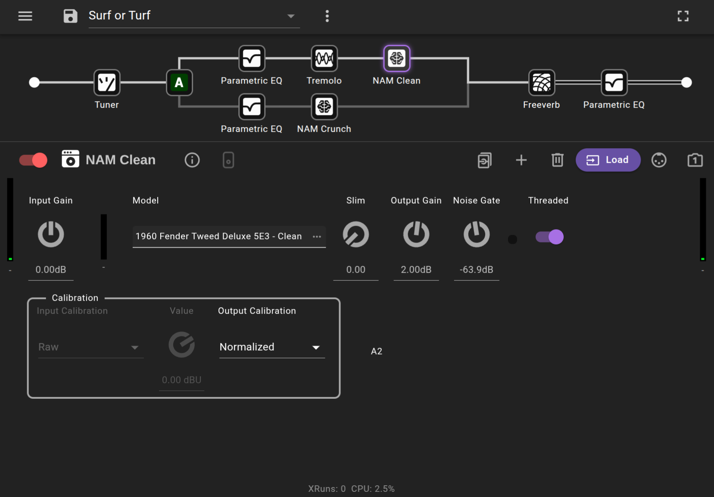
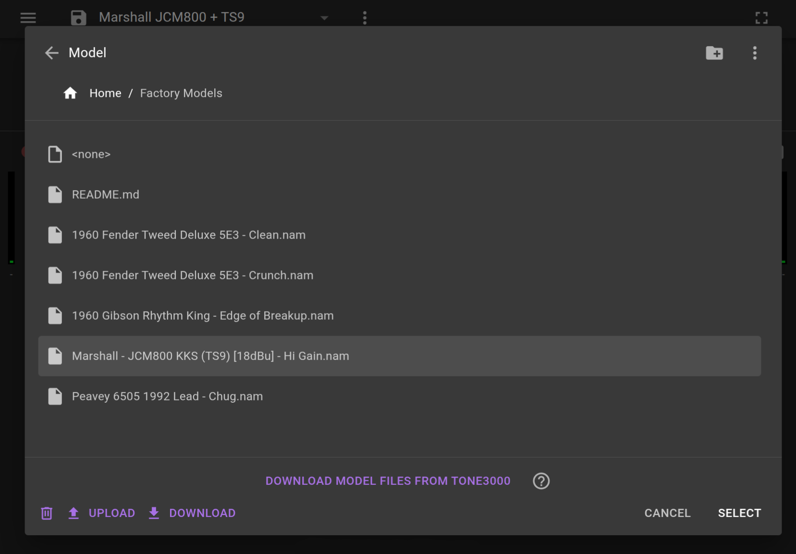
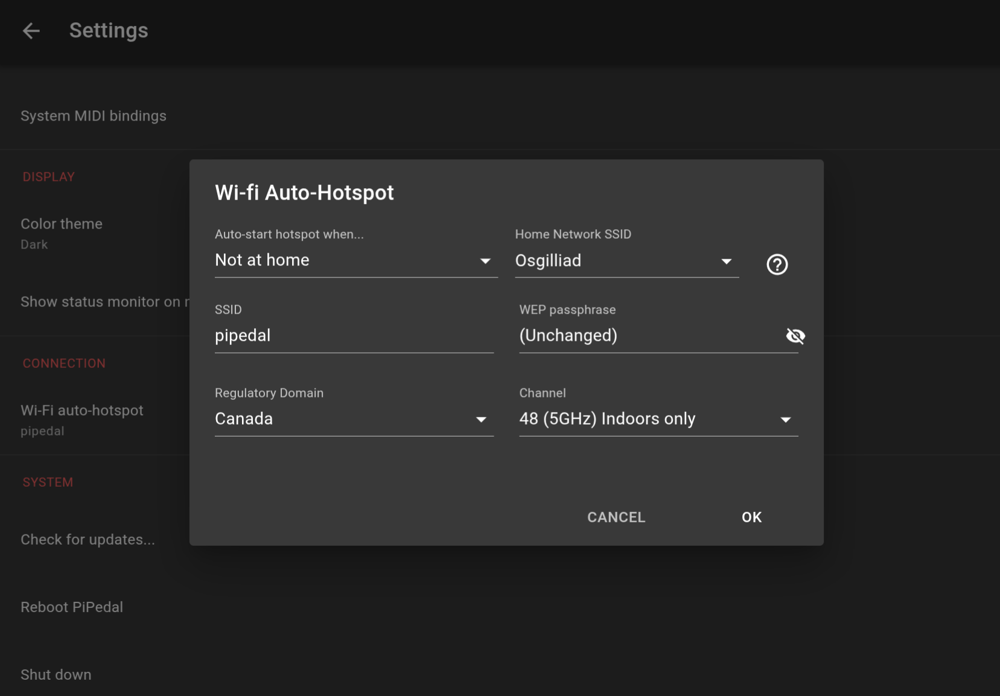
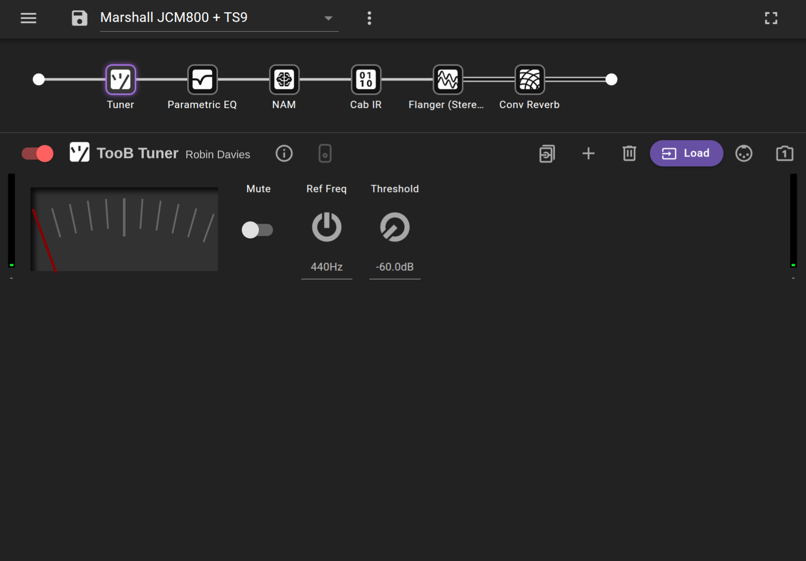
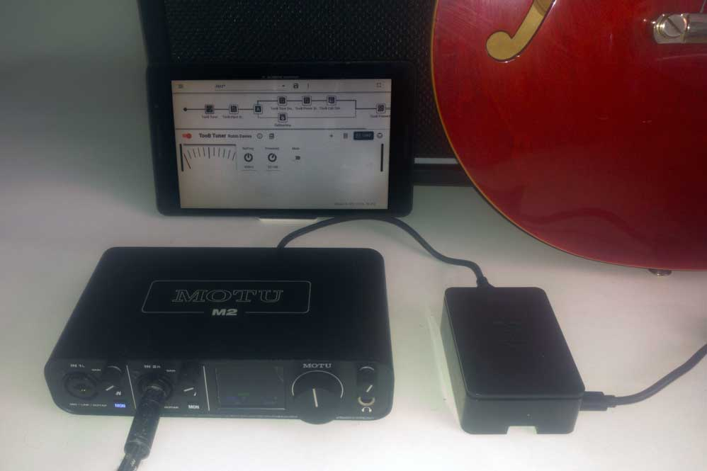
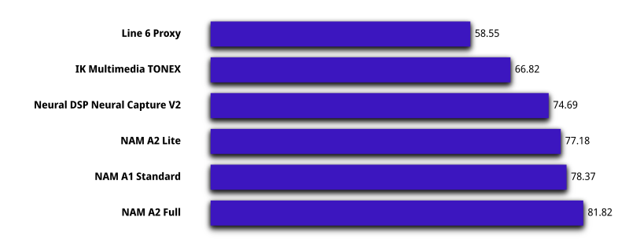

 

Download:&nbsp;<a href='https://rerdavies.github.io/pipedal/download.html'>v2.0.107</a> 
Website:&nbsp;[https://rerdavies.github.io/pipedal](https://rerdavies.github.io/pipedal).
Documentation:&nbsp;[https://rerdavies.github.io/pipedal/Documentation.html](https://rerdavies.github.io/pipedal/Documentation.html).

#### Announcing PiPedal 2.0 (2.0.107)&mdash;a major update to PiPedal, including exciting new features. See the Pipedal website [documentation](https://rerdavies.github.io/pipedal/PiPedal.html) for more information.

&nbsp;

Use your Raspberry Pi, or Ubuntu amd/x86-64 computer as a guitar effects pedal. Configure and control PiPedal remotedly, with your phone or tablet, or via a web browser.

PiPedal running on a Raspberry Pi 4 or Pi 5 provides stable super-low-latency audio via external USB audio devices, or internal Raspberry Pi audio hats.

PiPedal runs on Raspbery Pi OS (Bookworm or Trixie), or Ubuntu 24.x or later (amd64/x86-64 and aarch64). Make sure you follow the [Ubuntu post-install 
instructions](https://rerdavies.github.io/pipedal/Configuring.html) to make sure your Ubuntu OS is using a  realtime-capable kernel.

</img>

</img> </img> </img></img>

https://github.com/user-attachments/assets/6ff585ff-69fa-4b54-8009-50ad071e328e

&nbsp;

New in PiPedal v2.0:

- Support for Neural Amp Modeler (NAM) A2 models.
- Direct single-step downloads of NAM A2 models to the Pipedal server using web services provided by <a href="https://tone3000.com/">Tone3000.com</a>.
- Install PiPedal as a Progressive Web App (PWA) on your Windows or Apple desktop or laptop in order to run PiPedal as a native application, without the clutter of browser chrome, address bars, and needless decorations.
- A new Channel Routing dialog which allows you to pass through Auxilliary audio channels, or unprocessed guitar inputs for later re-amping in a DAW or external hardware. 
- New NAM A2-based Factory Presets, and a small selection of NAM A2 models pre-installed and ready to use.

PiPedal includes state-of-the-art AI-based guitar amp emulation, using the TooB Neural Amp Modeler technology. And PiPedal 2.0 now includes support for the brand new NAM A2 technology, which provides event more accurate amp simulations than NAM A1, while using even less CPU. Experience the ground-breaking quality of NAM A2 models now, with PiPedal's low-latency audio engine running on your Raspberry Pi or Ubuntu computer.

NAM changes everything! Simulations that not only sound like the real thing, but also respond to your playing dynamics in the same way as the real amp. NAM amp simulations are demonstrably and measurably better than amp simulations from competing commercial vendors.

    <strong>Fig 1:</strong> Unscreened ratings from a large-scale blind MUSHRA listening test evaluating
    NAM A2 amp/effect modeling against other commercial
    modelers. 105,842 ratings from
    1,184 participants across 37 tones. Data provided by <a href="https://www.tone3000.com" target="_blank" rel="noreferrer">TONE3000</a> and <a href="https://www.neuralampmodeler.com/">Steve Atkinson</a> under a CC-BY 4.0 license. 
    <a id="fnref1" href="#fn1">1</a>

PiPedal 2.0 integrates with Tone3000.com's web services, allowing you to directly install new NAM A2 models on the pipedal server without ever leaving the PiPedal user interface. Or download and install commercially-developed NAM models from a rich ecosystem of model providers.

PiPedal can be remotely controlled via a web interface over Ethernet, or Wi-Fi. If you don't have access to a Wi-Fi router, PiPedal can be configured to 
start a Wi-Fi hotspot automatically, whenever your Raspberry Pi can't connect to your home network.

Install the [PiPedal Remote Android app](https://play.google.com/store/apps/details?id=com.twoplay.pipedal) to get one-click access to PiPedal via Wi-Fi networks, or Wi-Fi hotspots. If you are using PiPedal away from home, you can configure PiPedal to automatically start a Wi-Fi hotspot whenever Pipedal is unable to detect your home network (Raspberry Pi OS only). The PiPedal Client Android app will allow to connect by simply launching the app, whether you are at home, or using a Wi-Fi auto-hotspot at a gig, when away from home.

PiPedal's user interface has been specifically designed to work well on small form-factor touch devices like phones or tablets. Clip a phone or tablet on your microphone stand on stage, and you're ready to play! Or connect via a desktop browser, for a slightly more luxurious experience. The PiPedal user-interface adapts to the screen size and orientation of your device, providing easy control of your guitar effects across a broad variety devices and screen sizes.

PiPedal includes a pre-installed selection of LV2 plugins from the ToobAmp collection of plugins; but it works with most LV2 Audio plugins. There are literally hundreds of free high-quality LV2 audio plugins that will work with PiPedal. Just install them on your Raspberry Pi, and they will show up in PiPedal.

If your USB audio adapter has MIDI connectors, you can use MIDI devices (keyboards, controllers, or midi floor boards) to control PiPedal while performing. A simple interface allows you to select how you would like to bind PiPedal controls to midi messages. 

----
&nbsp;

#### [System Requirements](https://rerdavies.github.io/pipedal/SystemRequirements.html)
&nbsp;

#### [Installing PiPedal](https://rerdavies.github.io/pipedal/Installing.html)
#### [Installing PiPedal on Ubuntu](https://rerdavies.github.io/pipedal/Ubuntu.html)
#### [Headless Operation](https://rerdavies.github.io/pipedal/HeadlessOperation.html)
#### [Configuring PiPedal After Installation](https://rerdavies.github.io/pipedal/Configuring.html)  
&nbsp;
#### [What PiPedal Is](https://rerdavies.github.io/pipedal/WhatPiPedalIs.html)
#### [Machine Learning in PiPedal (A History)](https://rerdavies.github.io/pipedal/PiPedalHistory.html)
#### [How to Use PiPedal](https://rerdavies.github.io/pipedal/HowToUsePiPedal.html)
#### [How to Build Presets With PiPedal](https://rerdavies.github.io/pipedal/BuildingPresets.html)
#### [An Intro to Snapshots](https://rerdavies.github.io/pipedal/Snapshots.html)  
#### [Neural Amp Modeler Calibration](https://rerdavies.github.io/pipedal/NamCalibration.html)  
#### [Choosing a USB Audio Adapter](https://rerdavies.github.io/pipedal/ChoosingAUsbAudioAdapter.html)  
#### [Optimizing Audio Latency](https://rerdavies.github.io/pipedal/AudioLatency.html)  
#### [Command-Line Configuration of PiPedal](https://rerdavies.github.io/pipedal/CommandLine.html)
#### [Changing the Web Server Port](https://rerdavies.github.io/pipedal/ChangingTheWebServerPort.html)

&nbsp;
#### [Using LV2 Audio Plugins](https://rerdavies.github.io/pipedal/UsingLv2Plugins.html)
#### [Which LV2 Plugins does PiPedal support?](https://rerdavies.github.io/pipedal/WhichLv2PluginsAreSupported.html)
#### [LV2 Plugins with MOD User Interfaces](https://rerdavies.github.io/pipedal/ModUiSupport.html)

&nbsp;

#### [Frequently Asked Questions](https://rerdavies.github.io/pipedal/FAQ.html)

&nbsp;

#### [Building PiPedal from Source](https://rerdavies.github.io/pipedal/BuildingPiPedalFromSource.html)
#### [Build Prerequisites](https://rerdavies.github.io/pipedal/BuildPrerequisites.html)
#### [The Build Systems](https://rerdavies.github.io/pipedal/TheBuildSystem.html)
#### [How to Debug PiPedal](https://rerdavies.github.io/pipedal/Debugging.html)
#### [PiPedal Architecture](https://rerdavies.github.io/pipedal/Architecture.html)

 

    <a href="#fnref1" aria-label="Back to figure note reference">1</a> TONE3000, &amp; Atkinson, S. (2026). <em>A2 MUSHRA Listening
        Test Raw Data</em> [Data set].
    Tone3000. <a href="https://www.tone3000.com/guides/nam-a2-the-complete-guide" target="_blank" rel="noreferrer">
        https://www.tone3000.com/guides/nam-a2-the-complete-guide
    </a>
    . Repository:
    <a href="https://github.com/tone-3000/a2-mushra-data" target="_blank" rel="noreferrer">
        https://github.com/tone-3000/a2-mushra-data
    </a>
    . License: CC BY 4.0. <a href="#fnref1" aria-label="Back to figure note reference">↩</a>

 

