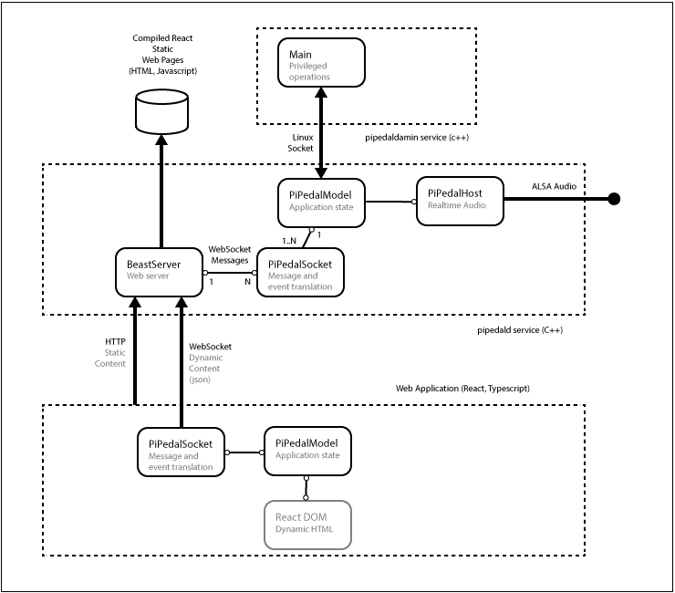
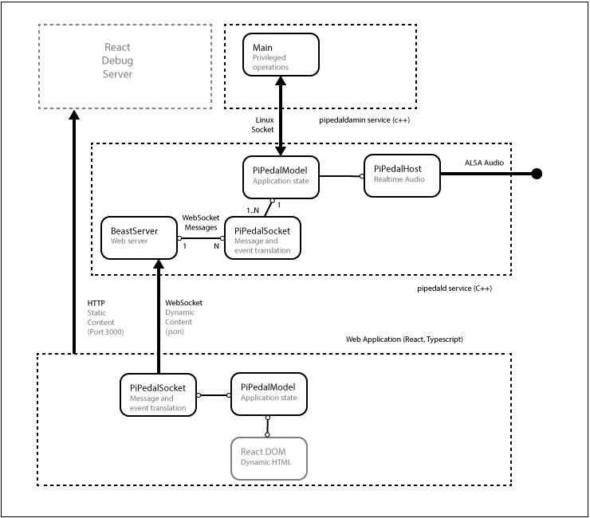

### PiPedal Architecture

The PiPedal client is a web application written in React Framework, using Typescript. The bulk of the application is static content
compiled from TypeScript sources, using React Framework tools. The static content is fetched from a web server hosted by the  `pipedald` service. Once loaded, the web application
opens a web socket connection to the `pipedald` server. Dynamic content is fetched over the web socket. The web client controls the server application using asynchronous json messages that are exchanged over the web socket. Changes to the state of the server application are propagated to all connected web clients via events that are fired by the server application over the web socket. Changes to the UI are (for the most part) implemented by binding state in the  client-side PiPedalModel with state data in the React Framework view model.

The PiPedal server is written in C++. The server relies on an additional service, `pipedaladmind`, which provides
privileged operations (e.g. shutdown, reboot, and configuration changes) for use by the main `pipedald` service
which runs on a service account without privileges.

See figure 1 for a diagram of the high-level architecture of PiPedal.



Fig 1. PiPedal Architecture.

HTML connections to the server are made over port 80 in production, or port 8080 when debugging.

When debugging React code, an instance of the React development server must be started. The development server serves static content on port 3000. To 
start the development server `cd` to the react directory, and run `./start`.
Figure 2 shows the architecture of PiPedal when running with the React debug server.



Fig 2. PiPedal architecture when using the React development server.

To debug React code, connect to the development server, on port 3000, with Chrome. To access the Chrome debugger, press F12. You should be able to browse the React source files from within the Chrome debugger. Load the typescript source file in the Chrome debugger. Once you have done that, you should be able to debug the Typescript code directly. Chrome will automatically detect that it is connected to a React debug server, and will automatically download symbol and map files from the React development server.

When using the React development server, the web client can be configured to make web socket connections to either a debug version of the server, with a web server at port 8080, or a production server, with a web server at port 80. When running with the React development server, edit 

`react/public/var/config.json:`
```
{
    "socket_server_port": 8080,
    "socket_server_address": "*",
    "debug": true,
    "max_upload_size": 1048576,
    "fakeAndroid": false,
    "ui_plugins": []
}
```

The `debug` value determines whether the web application will disable background context menus. Enabling context menus allows you to select the 'Inspect' menu item, which is useful when debugging HTML content.

The `fakeAndroid` setting determines whether the web application will use touch-interface interactions instead of mouse-interface interactions. There are a number of subtle adaptations the web app makes to accommodate touch interfaces.

Note that, when connecting directly to the pipedald web server on port 80, or port 8080, the web server intercepts all requests to documents in the `var` directory, including the `var/config.json` file, and instead returns data that reflects the configuration of the pipedald service. The contents of the `public/var` directory will be completely ignored. The `debug` setting will be true if the pipedald service is a Debug build, and will be false if the pipedald service is a Release build. The `fakeAndroid` setting will always be false.

-----
[<< How to Debug PiPedal](Debugging.md) | [Up](Documentation.md)