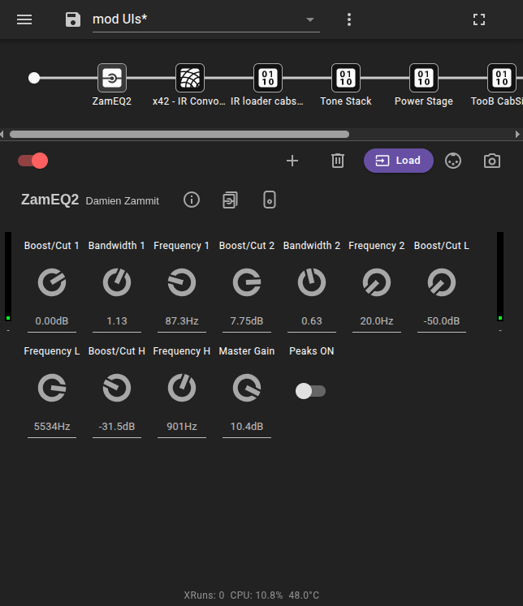

## Support for LV2 Plugins with MOD User Interfaces



Some LV2 plugins (currently a minority of plugins) provide custom plugin user interfaces based on [MOD Audio's](https://mod.audio/desktop/) 
[ModUi framework](https://wiki.mod.audio/wiki/MOD_Web_GUI_Framework). When using such a plugin, you can choose whether to use the MOD Web GUI Framework user interface (the MOD UI) or the default PiPedal user interface. For the most part, the same functionality is available in both interfaces.

Plugins that are distributed via Linux distributions usually do not implement MOD user interfaces; but all (or almost all) of the plugins that are available from the [PatchStorage website](https://patchstorage.com/platform/lv2-plugins/) do implement MOD user interfaces. Many plugins that are available from GitHub or other sources also implement MOD user interfaces. Often you can find updated versions of a plugin that is published by a distro on PatchStorage which does provide a MOD UI.

Here's an example of a MOD UI for the ZAM Eq2 plugin:

And the PiPedal UI for the same plugin:

Which UI you use is entirely up to you. MOD UIs tend to be a bit unfriendly for small-format devices like phones, but they do look great in a desktop browser. Sometimes the MOD UI will make better use of available screen space; sometimes the Pipedal UI will look better. It really depends on the plugin and your personal preferences. In this particular case, the MOD UI is more space efficient, but that is not always true.

To select which user interface to use, tap on the UI selection button in the toolbar for the plugin. If the plugin does not provide a MOD UI, the button will be disabled. 

Support for MOD UIs in PiPedal is still experimental, so you may encounter some issues. PiPedal does not yet support all of the features of the MOD UI framework, not because it can't, but because we haven't been able to locate examples of plugins that use those features, which makes it difficult to test. If you encounter any issues, please report them on PiPedal's [GitHub Issues page](https://github.com/rerdavies/pipedal/issues), and we will do our best to provide quick fixes.

&nbsp;

--------
[<< Which Plugins are Supported?](WhichLv2PluginsAreSupported.md)  | [Up](Documentation.md) | [Frequenty Asked Questions >>](FAQ.md)
