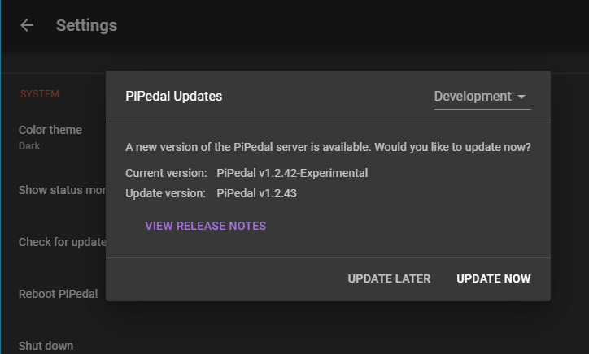

# Release Notes
## PiPedal 1.2.47 Release

This version fixes a significant and dangerous defect that may cause loss of presets, banks or configuration data if you remove power from your Raspberry Pi within up to five minutes of last saving data instead of performing an orderly shutdown or reboot. Users of PiPedal should upgrade immediately.

This release also fixes a significant performance issue with TooB Neural Amp Modeler.

Bug fixes:
- Explicity sync files to disk immiately after saving, so that they won't be lost if power is removed from the Raspberry Pi.
- Fixes a significant performance issue with TooB Neural Amp Modeler.

## PiPedal 1.2.45 Release

This version focuses on fixes and improvements to TooB Neural Amp Modeler.
TooB NAM now uses about 20% less CPU, which can help enormously on Raspberry Pi 4. 

You may need to change your audio buffers to prevent dropouts when using TooB Neural Amp Modeler. Setting your audio buffers to 32x4 seems to produce good results. You may also want experiment with 16x4 audio buffers. This seems to work, but it has had limited testing so far, so I can't say with any certainty whether it is stable for long-term use. 2-buffer audio settings should be avoided. As always, using your Pi for anything else at the same time you are using PiPedal will cause XRuns.

I would once again like to extend special thanks and acknowledgements to Steven Atkins for his outstanding work on the NeuralAmpModelerCore project on which TooB Neural Amp Modeler depends (as do almost all other Neural Amp Modeler plugins).

Bug fixes:

- The About page now displays the correct version.
- TooB NAM frequency response now displays correctly.
- TooB NAM no longer displays error messages when loading.
- Update Dialog has better layout on portrait phone displays.
- Prevent brief flashing of the Reload... button during the last phase of an update.

## PiPedal 1.2.44 Release 

This version includes the following new features:

- Double-tap (or double-click) dial controls to reset them to default values.
- Update PiPedal to the latest version from within the PiPedal web UI or PiPedal client. PiPedal monitors the PiPedal github repository for new releases,
  and prompts you to update when new releases become available.
- Choose whether to monitor Release, Beta or Developer update streams, or disable update monitoring altogether.
- All PiPedal configuration settings now preserved when upgrading.
- Advanced configuration options are now stored in /var/pipedal/config/config.json so that they are preserved when upgrading.

Bug fixes:

- Fixed a bug which prevents the PiPedal UI from updating properly when using TooB Convolution Reverb and CabIR effects.
- Plugin controls now work when there's no audio device running, or when the audio device stops.
- Minor style and theming issues.

## PiPedal 1.2.41 Release 

This version includes the following new features:

- Supports Raspberry Pi 5.
- Supports Rasberry Pi OS Bookworm.
- TooB ML allows uploading of models. See below for further details.
- TooBML support for large models (e.g. GuitarML Proteus models)
- Upload .zip file bundles to all File plugin controls.
- Uploads can be organized into sub-directories.
- PiPedal now monitors LV2 plugin directories for changes, and automatically updates available plugins in the 
  PiPedal UI, without requiring a restart.
- Various minor improvements to TooB plugin user interfaces.

You can now upload new models into TooB ML. TooB ML models are compatible with models for the GuitarML Proteus plugin. Currently, the GuitarML Proteus model download pages are the best source for new models to use with TooB ML. To install 
new models in TooB ML, follow these instructions:

- Download Proteus models from https://guitarml.com/tonelibrary/tonelib-pro.html to your local computer or Android
  device. TooB ML supports both Proteus .json models, and also allows you to install model collections contained in .zip files.
- Load the TooB ML plugin.
- click on the Model control.
- click on the Upload button in the lower left corner of the Model selection dialog.
- Upload the .json model file or .zip model collection that you downloaded from The GuitarML Tone Library.

Big fixes:
- Wi-Fi is restarted properly without requiring a reboot when the PiPedal Wi-Fi Direct connection is disabled.
- Dialog button colors follow Android UI conventions.
- The web server supports uploading of large files (limited by default to 512MB).
- Failure to open audio devices upon reboot for devices that initialize slowly.
- Misbehavior with preset names after renaming a preset.
- Dialog button colors follow Android UI conventions.
- Toggle and on/off controls now display in purple instead of red/pink.
- automatic provisioning of resource files in .LV2 plugins.
- Gain control for ToobML is enabled or disabled depending on whether the model has a gain control input (Thanks to @Foolhen)
- The control view for split controls now displays properly.
- Stereo connectors in dark mode now render properly.
- Permissions are correctly set on existing files and folders in /var/pipedal at install time. `pipedalconfig1 has a new
  `--fix-permissions` option, which corrects permissions on files in /var/pipedal.
- Bypass MIDI bindings now work properly. Thanks to @FoolHen.
- GxTuner now correctly displays note pitches. Thanks to @FoolHen.
- Fixed glitch in on-boarding process when changing Wi-Fi direct settings.
- Fixed incorrect display of banks in dark mode Thanks to @FoolHen.
- pidedald service shuts down cleanly. With help from @FoolHen.
- Fixed missing dependency in build procedure documentation. Thanks to @FoolHen
- Documentation edits and corrections. With help from @FoolHen.
- automatic provisioning of resource files in .LV2 plugins (devolopment feature)
- uninstall.sh now removes all files installed by ./install.sh (used only during development).

## Pipedal 1.2.40 Beta6
- PiPedal now monitors lv2 directories in order to automatically add newly-installed LV2 plugins.
- Toggle and on/off switch colors changed from red/pink to purple.
- MIDI bindings can be created for split controls. 

## Pipedal 1.2.38 Beta5

Fixes:
- PiPedal won't run on non-en-US locales.

## Pipedal 1.2.37 Beta4

You can now upload GuitarML Proteus models from the GuitarML project into TooB ML.

- Download Proteus models from https://guitarml.com/tonelibrary/tonelib-pro.html
- Load the TooB ML plugin.
- click on the Model control.
- click on the Upload button in the lower left corner of the Model selection dialog.
- Upload the .json model file or .zip model collection that you downloaded from The GuitarML Tone Library.

Features:
- ToobML allows uploading of models.
- TooBML support for large models (e.g. GuitarML Proteus models)
- Support for sub-directories when uploading files.
- Support for uploading .zip file bundles.

Fixes for the following issues: 
- Dialog button colors follow Android UI conventions.
- automatic provisioning of resource files in .LV2 plugins.
- The web server supports uploading of large files (limited by default to 512MB).

## Pipedal 1.2.36 Beta3

Fixes for the following issues: 

- Failure to open audio devices on reboot for devices that initialize slowly.
- TooB ML and Toob Neural Amp Modeller UI issues.
- Misbehavior with preset names after renaming a preset.
- Change default audio buffers to 64x3.
- Filtering not working in plugin selection dialog.

## PiPedal 1.2.34 Beta2

Fixes the following issues:

- Midi Bindings can now be created for controls in a Split.
- Gain control for ToobML is enabled or disabled depending on whether the modal has a gain control input.
- The control view for split controls now displays properly.
- Stereo connectors in dark mode now render properly.
- Permissions are correctly set on existing files and folders in /var/pipedal at install time.
- pipedalconfig has a new --fix-permissions option, which corrects permissions on files in /var/pipedal.

## PiPedal 1.2.33 Beta1

This release provides compatibility with Raspberry Pi OS bookworm. If you are using Raspberry Pi OS bullseye, or Ubuntu 21.04, please use PiPedal v1.1.31 instead.

If you are using the Android client, you should make sure you are using the most recent version, which includes significant improvements to Wi-Fi Direct pairing.

Bug Fixes:

- Support for NetworkManager network stacks used buy Raspberry Pi OS Bookworm, and Raspberry Pi 5 devices.
- The .deb package now installs on Raspberry Pi OS Bookworm and Raspberry Pi 5 devices.
- Bypass MIDI bindings now work properly. Thanks to @FoolHen.
- GxTuner now correctly displays note pitches. Thanks to @FoolHen.
- Fixed glitch in on-boarding process when changing Wi-Fi direct settings.
- Fixed incorrect display of banks in dark mode Thanks to @FoolHen.
- pidedald service shuts down cleanly. With help from @FoolHen.
- Fixed missing dependency in build procedure documentation. Thanks to @FoolHen
- Minor documentation corrections. With help from @FoolHen.
- uninstall.sh now removes all files installed by ./install.sh (used only during development).
  
## PiPedal 1.1.31

- Use system preferences for dark mode when connecting from Android app.

## PiPedal 1.1.29

Bug fixes:

- TooB Convolution filenames not updating properly.

## PiPedal 1.1.28

New in this release.

- TooB Neural Amp Modeler - an LV2 port of  Steven Atkinson's astounding Neural Amp Modeler. Donwload model files from [ToneHunt.org](https://tonehunt.org). CPU is very high -- it runs on a Raspberry Pi 4 with just enough CPU left over for a couple of extra effects; but the results are worth it. TooB ML provides Neural Net modelled guitar amps with more modest CPU use (but considerably less flexibility).

- Dark mode. Go to the settings dialog to turn on Dark Mode. 

Bug fixes:

- Plugin information is updated in the web app after reconnecting, in order to pick up new plugins that may have been detected while the web server was being restarted.

## PiPedal 1.1.27

- Add missing lv2-dev dependency.

## PiPedal 1.1.26

- Revised file browser protocol for NAM and MODP plugin compatibility.
- Revised resource file publication extension.

## PiPedal 1.1.25

- New TooB BF-2 Flanger plugin
- New TooB Stereo Convolution Reverb

## PiPedal 1.1.24

- Reduce TooB Convolution Reverb and Toob Cab IR CPU use by 90%.

## PiPedal 1.1.23

Features:

-    Two new plugins: TooB Convolution Reverb, and TooB Cab IR.

-    Output ports for LV2 plugins are now displayed (vu meters and status controls)

-    File selection dialog, and uploads for LV2 atom:path Properties for 3rd party LV2 plugins.

Bug fixes:

-    Improvements to onboarding procedure.

-    Problems with restarting audio after changing audio parameters.

-    Occasional loss of audio after reboot caused by ALSA USB initialization race conditions.
