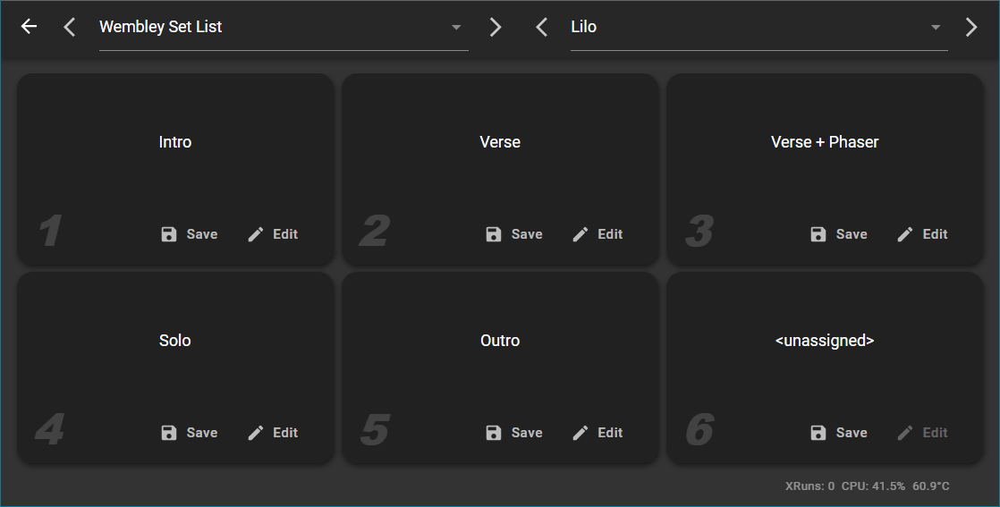

## An Intro to Snapshots

You can create up to six snapshots for any given preset. A snapshot differs from a preset in that 

  

- Switching between snapshots does not reload the plugins you are using. Snapshots contain only control values.
- Because effects are not reloaded, you won't get discontinuities in the output of effects with long tails (like reverb effects, for example).
- Loading a snapshot is much faster than loading a preset, because new plugins don't have to be created.
- You can configure PiPedal to switch between snapshots in response to MIDI messages from a MIDI foot controller or other device.`

Snapshots are particularly useful if you have a USB or MIDI foot controller. You can configure PiPedal to switch between snapshots when you step on buttons on your foot controller. To configure MIDI bindings for snapshots, select <b><i>Settings</i></b> from the main menu, and tap on <b><i>System MIDI bindings</i></b>.

But snapshots are equally useful when you are using PiPedal's <b><i>Performance View</i></b>. To access the <b><i>Performance View</i></b> click on the <b><i>Performance View</i></b> menu item in the main PiPedal menu.
  

&nbsp;&nbsp;&nbsp;&nbsp;&nbsp;&nbsp;&nbsp;&nbsp;&nbsp;PiPedal's Performance View

Note how PiPedal has been configured to use <i>banks</i> as containers for songs in a set list. Each song in the setlist gets its own preset; and then snapshots are used to change controls for the preset being used in each song. As an example, the only difference between <i>Chorus</i> and <i>Chorus + Phaser</i> snapshots is whether the Phaser plugin is bypassed or not. You are of course, free to arrange your own banks and presets any way you want. But if you have a complex repertoire of songs that you play regularly, this is a good way to arrange your preset: set lists go into banks; songs go into presets; and then you use snapshots to switch between settings used in the same song.

  

#### Accessing Snapshots in the PiPedal User Interface.

You can create, modify, and select snapshots in two places in the  PiPedal user interface. 

The first is via the <b><i>Snapshot</i></b> icon button in the middle row of controls in the main page of pipedal. It's the button that looks like a camera. The second is via the <b><i>Performance View</i></b>, which is accessible via the <b><i>Performance View</i></b> menu entry in the main PiPedal menu. 

It's easier to create an initial set of snapshots from the main PiPedal page. You edit the current controls of the current preset, and you can then save current control values to a snapshot by first pressing the <b><i>Snapshots</i></b> icon button (the camera icon), and then pressing the <b><i>Save</i></b> button for a particular snapshot in the popup dialog.

On the other hand, you may find it easier to edit an existing set of snapshots from the <b><i>Performance View</i></b>. When you click the <b><i>Edit</i></b> button for a particular snapshot, PiPedal displays the <b><i>Snapshot Editor</i></b> which allows you to edit the control values for that snapshot directly.

  

#### Interactions between Presets and Snapshots.

As a general rule, it's best to get the structure (which plugins are loaded, and how they are connected together) settled before you start creating snapshots. If you change the structure of a preset, it may affect snapshots that belong to that preset. 

Each preset has its own set of preset control settings which are independent of the control settings in each snapshot. But all share the same plugin structure (which plugins are loaded, and how they are connected together). 

When  you click the edit button in the Performance View, you are editing control settings associated with the snapshot. When you press the back button from the snapshot editor, control settings for that snapshot are saved immediately. Saved control settings for the preset are not modified. You can avoid saving snapshot control settings by pressing the Cancel icon button (X) at the end of the toolbar for the snapshot editor. You cannot change the structure of the plugins in the preset to which snapshots belong from within the Snapshot editor. Nothing you do in the snapshot editor will affect the saved control values for the currently loaded preset.

 Things are different when you are editing presets in the main PiPedal page. Changes to preset controls are not saved until you press the Save button. And you can make structural changes. When you make structural changes to the preset, you may also affect the control settings included in each snapshot. You can move plugins around freely. Snapshot controls will still apply to the plugin even if it has moved. But if you remove a plugin, the settings for that plugin in each snapshot will be removed. Even if you re-add a new instance of of the same plugin, settings in snapshots will not be remembered. And if you add a plugin, selecting a snapshot will set controls for the new plugin to default values (not the values of the controls in the main preset). So as a general rule, it's best to get the structure of a preset more-or-less settled before you start creating snapshots. 

--------
[<< Using TooB Neural Amp Modeler](UsingNAM.md) | [Up](Documentation.md) | | [Choosing a USB Audio Adapter >>](ChoosingAUsbAudioAdapter.md)
