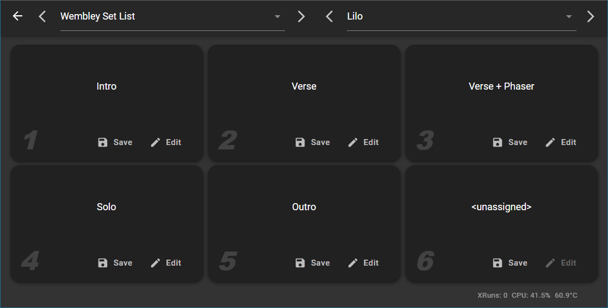

## An Intro to Snapshots

You can create up to six snapshots for any given preset. A snapshot differs from a preset in that 

  

- Switching between snapshots does not reload the plugins you are using. Snapshots contain only control values.
- Because effects are not reloaded, you won't get discontinuities in the output of effects with long tails (like reverb effects, for example).
- Loading a snapshot is much faster than loading a preset, because new plugins don't have to be created.
- You can configure PiPedal to switch between snapshots in response to MIDI messages from a MIDI foot controller or other device.`

Snapshots are particularly useful if you have a USB or MIDI foot controller. You can configure PiPedal to switch between snapshots when you step on buttons on your foot controller. To configure MIDI bindings for snapshots, select <b><i>Settings</i></b> from the main menu, and tap on <b><i>System MIDI bindings</i></b>.

But snapshots are equally useful when you are using PiPedal's <b><i>Performance View</i></b>. To access the <b><i>Performance View</i></b> click on the <b><i>Performance View</i></b> menu item in the main PiPedal menu.
  

&nbsp;&nbsp;&nbsp;&nbsp;&nbsp;&nbsp;&nbsp;&nbsp;&nbsp;PiPedal's Performance View

Note how PiPedal has been configured to use <i>banks</i> as containers for songs in a set list. Each song in the setlist gets its own preset; and then snapshots are used to change controls for the preset being used in each song. As an example, the only difference between <i>Chorus</i> and <i>Chorus + Phaser</i> snapshots is whether the Phaser plugin is bypassed or not. You are of course, free to arrange your own banks and presets any way you want. But if you have a complex repertoire of songs that you play regularly, this is a good way to arrange your preset: set lists go into banks; songs go into presets; and then you use snapshots to switch between settings used in the same song.

  

#### Creating Snapshots in the PiPedal User Interface.

You can create, modify, and select snapshots in the main PiPedal preset editor. 

Click on the <b><i>Snapshot</i></b> icon button in the middle row of controls in the main page of pipedal. It's the button that looks like a camera. 

  

#### Interactions between Presets and Snapshots.

As a general rule, it's best to get the structure (which plugins are loaded, and how they are connected together) settled before you start creating snapshots. If you change the structure of a preset, it may affect snapshots that belong to that preset. 

Each snapshot has its own set of preset control settings which are independent of the control settings in each snapshot. But all share the same plugin structure (which plugins are loaded, and how they are connected together). 

If you make structural changes to a preset that add a new plugin, there will not be control settings for the new plugins in any of the snapshots (they will default to the values of the controls in the main preset, or whichever snapshot was last loaded, which may lead to unexpected results when switching between snapshots). You can actually re-order plugins within a preset, or remove plugins without affecting the control settings in a snapshot. But if you add a new plugin, there will be no saved values for the controls of the new plugin in each of the snapshots. If you do add a new plugin, it would be a good idea to go through each of the snapshots, and resave them to make sure that control settings for each of the snapshots are what you expect them to be. 
 

--------
[<< How to Build Presets With PiPedal](BuildingPresets.md) | [Up](Documentation.md) | [Neural Amp Modeler Calibration >>](NamCalibration.md)  
