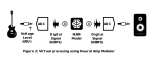

# Using TooB Neural Amp Modeler

The living breathing heart of Pipedal is actually the TooB Neural Amp Modeler plugin, although you would be forgiven for not guessing that's the case.

Steven Atkinson's [Neural Amp Modeler](https://www.neuralampmodeler.com/) project is an open-source project that provides a framework for creating digital models of guitar amplifiers, speaker cabinets, and effects pedals, using machine learning techniques. The models are created by training a neural network on input-output pairs of audio data, where the input is the signal from a guitar plugged into a real amplifier or effect pedal, and the output is the signal recorded from the output of that amplifier or pedal. The result is a digital model that can replicate the sound of the original hardware with remarkable fidelity.

The results are astonishing. Models are capable of producing sounds that are virtually indistinguishable from the real hardware, including the complex nonlinearities and dynamic response characteristics that are difficult to capture with traditional modeling techniques. "This changes everything" is a phrase that comes up often when discussing Neural Amp Modeler. PiPedal didn't really start out this way, but it has gradually evolved into a platform whose principle purpose is providing access to Neural Amp Modeler models in a live performance context. That's how good NAM is.

PiPedal allows you to use Neural Amp Modeler profiles (.nam files) with the TooB Neural Amp Modeler plugin, which is bundled with PiPedal.

Although TooB ML models produce exceptionally good results, TooB Neural Amp Modeler produces significantly better results. Awkwardly, none of the built-in factory presets for Pipedal currently contain TooB Neural Amp Modeler plugins, because I am still working on obtaining NAM models that are licensed under terms that are compatible with Pipedal's MIT license. (Working on that, expect some progress soon). 

So I would urge you, in the meantime, to experiment with TooB Neural Amp Modeler using free .nam files downloaded from [Tone 3000](www.tone3000.com), or perhaps purchase some commercial NAM profiles from any of several providers of non-free NAM profiles on the Internet. (Totally worth it!)

The remainder of this page deals with issues relating to how to get the absolute best results out of TooB Neural Amp Modeler. This is not required reading. You will get excellent results if you never read what follows. The purpose of what follows is to provide an explanation of model calibration in TooB Neural Amp Modeler&mdash;how it works, why you might or might not want to use it, and how to get good results even if you don't use it. "Calibration" is a confusing feature. It doesn't entirely do what you might it expect it do do. But it does provide useful functionality that may allow you to make even better use of NAM.

## Calibrating TooB Neural Amp Modeler

This feature isn't what you think it is.

Calibration allows you replicate the sound that your actual physical guitar would make if it were plugged into the actual
physical guitar amplifier with the exact same control settings on the amp that were used when the NAM profile was created.

While this is certainly an interesting exercise, it is not necessarily a useful one. To properly calibrate your setup, you
will need to perform a fairly elaborate measurement procedure on the output of your physical guitar, using a fixed set of volume, tone control, and pickup settings. And once you have made that measurement, you will need to make sure that you always play with those exact same settings on your guitar. Any change to the guitar settings will invalidate the calibration. And of course, you will need to make sure that your guitar is always strung with the same gauge strings, and that you always play with the same pick, and that you always play with the same attack strength, and so on. So while it is an interesting exercise, it is not a particularly practical one.

Nonetheless, there is a fairly active community of users who are interested in this sort of thing, and who want to get the most accurate possible sound from their NAM profiles. They know who they are, and they know what to do. But for the rest of us, it may just be simpler and more effective, and certainly far more creatively useful to twiddle the Input Gain and Output Gain controls in TooB Neural Amp Modeler until we get a sound that we like.

There is no requirement to perform this calibration step. You can simply use the TooB modeler with its default settings, and it will sound good with most guitars and playing styles. You can then adjust the amp model settings to suit your own tastes and playing style.

There, however, is some value to understanding the calibration process, as it may help you understand how the TooB Neural Amp Modeler works, and it may help you more efficiently dial in a sound that is close to what you want.

If you frankly don't much care about any of this (and why would you?), skip to the section "What if I Don't Want to Calibrate my Setup?", for useful guidance on trimming input and output levels for uncalibrated setups.

### What Calibration Actually Does

The purpose of the calibration process is to precisely replicate the sound of a physical system

with this virtual system

The X's mark the points at which TooB Neural Amp Modeler makes adjustments to signal levels, in order to recreate the sound of the physical system. These adjustments are made based on metadata information found in the .nam profile file, and based on voltage measurements that you will have to make yourself.

Before getting started, we need to establish a couple of important definitions. dBU (peak) is a unit of measurement of peak voltage level, relative to 0.775 volts RMS. dBU is a common standard in pro audio, and is used to measure line-level and instrument-level signals. dBFS (peak) is a measurement of digital audio levels, relative to the maximum possible digital level. VU meters in PiPedal measure digital dbFS (peak) levels. 0 dBFS is the maximum possible digital level, and all other levels are negative numbers. -6 dBFS is half the maximum digital level, -12 dBFS is one quarter the maximum digital level, and so on. In fact, when processing virtual audio in PiPedal, there is no actual maximum level. When processing digital, the signal is represented as floating point numbers, which can exceed 0 dBFS. However, when the audio is converted to analog, it is hard-clipped at 0 dBFS. And similarly, when input audio signals are converted to digital representation, the input value will never exceed +/- 1.0, which is 0 dBFS. So for the purposes of this discussion, we will treat 0 dBFS as the maximum possible level -- a level that corresponds to +/- 1.0 in floating point representation.

It is important to keep this distinction in mind, because the calibration process is all about matching the voltage levels of the physical system to the digital levels of the virtual system. The goal is to ensure that when you play your guitar with a certain attack strength, the digital signal input the the internal NAM model running at the heart of TooB Neural Amp Modeler is at the correct level to replicate the sound of the physical amplifier. Remember: dBU is a measurement of real-world voltage levels, while dBFS is a measurement of digital signal audio levels.

To get the whole process to work, we need to know two things:

- What was the voltage level of the input signal to the guitar amplifier when the NAM profile was created? This information is provided by metadata in the NAM file itself, and is set by the author of the NAM profile. 
- What is the voltage level of your guitar signal when you play with your normal attack strength? You have to measure and provide this value using a voltmeter.

Calibration reference levels in the .nam profile files are determined by the author of the NAM profiles, and are done using a completely different procedure than the one used to measure guitar input signal levels. When generating a NAM profile, the author will typically use a signal generator to produce a test signal at a known voltage level, and will then record the output of the amplifier being modelled. The test signal is typically synthetic signal (so not an actual guitar signal) that is designed to probe the response of the amplifier. The author will then use this recorded data to train the neural network that is at the heart of the NAM profile. The author will also record the voltage level (in dBU) of the test signal, and will include this information as metadata in the .nam profile file. Typically the training signal fed to the amp exceeds the signal level of a real guitar. The trained model can only reproduce what it has seen during training, so the test signal will deliberately incorporate some headroom to ensure that the model will see enough data at close-to-maximum levels to create faithfully reproductions of real guitar signals, and to ensure that the model output doesn't completely collapse if fed data that slightly exceeds expected input ranges. How much headroom is provided reflects authorial intent. Some models may be optimized for use with single-coil pickups, others might be optimized for use with extreme voltage inputs generated by active lace pickups followed by a Gain pedal in order to force input buffers into overdrive. Keep in mind that it's fairly simple to generate your OWN NAM profiles; so you might actually decide to train a model that expects really hot input signals (in dBU) for your own personal use.

When you play your guitar, you will be producing a guitar signal at some voltage level that depends on your guitar, your pickups, your playing style, and so on. You need to measure this voltage level using a voltmeter. This is your guitar signal level.

Note that if you do not measure the voltage level of your guitar signal, then the calibration process will not work properly. You can still get perfectly good sound without calibration, but the sound will not be a precise match to what you would get from the physical amplifier when playing with your physical guitar.

To get calibrated results, you must:

1. Measure the dBU signal level of your actual physical guitar. 
2. Adjust the input gain control of your audio interface so that digital signal level is as close 0dBFS (peak) as you can practically get it, without clipping. This will ensure that you have the maximum possible dynamic range for your guitar signal.
3. Load the NAM profile into TooB Neural Amp Modeler.
4. Set the "Input Calibration" control in TooB Neural Amp Modeler to "Calibrated".
5. Set the calibration Value in TooB Neural Amp Modeler to the measured voltage level that you measured in step 1.
6. Set the "Input Gain" control in TooB Neural Amp Modeler to zero dB.

Once you have completed these steps, TooB Neural Amp Modeler will make the necessary volume adjustments to the signal being fed to the Neural Amp model, based on the Calibration Value you entered, and the Calibration level of the NAM profile (as provided by the author of the NAM profile), in order to replicate the sound of the physical amplifier when playing with your physical guitar.

Note that if you change the volume level of your guitar, or if you change the attack strength of your playing, or if you adjust the tone or volume controls then the calibration will no longer be valid. You will need to re-measure the voltage level of your guitar signal, and re-enter that value into TooB Neural Amp Modeler.

Note also, that calibration generally only works for the first NAM plugin in an effect chain. Although it is theoretically possible to calibrate the output level of a model that emulates a guitar effect pedal, this is not a common use case, and is not well supported by existing .NAM files found in the field. And for amplifier models, there is no actually no reasonable interpretation of output calibration, since the output signal of an amplifier is not intended to be fed into another amplifier, and is often a recording of a speaker as recorded through a microphone, for which there is no sensible corresponding voltage level.

### What if I Don't Want to Calibrate my Setup?

Well, then you won't get calibrated output. But you will still get perfectly good sound. You can simply adjust the "Input Gain" control in TooB Neural Amp Modeler to suit your own tastes and playing style. The sound of the amp model is determined by the selected model and its parameters, not by this calibration process.

There is some value to turning calibration on, even if you don't actually perform the calibration process. You can set a fictional dBU level in the TooB Neural Amp Modeler. Typical dBU measurements for guitar signals are usually in the range of -20 dBU to -2 dBU. Humbucker pickups tend to be in the -10 dBU to -2 dBU range, and are nominally somewhere around -6 dBU. Single coil pickets tend to be somewhere in the -6 to -20 dBU range, and are nominally about -11 dBU. So if you were to set the calibration value to -6 dBU, and trim your digital signal to 0 dBFS, then you would feed the model with data that is close to what the model would expect where you to be playing with a fictional guitar that produces -6 dBU voltage levels. So not calibrated, but almost certainly in the right range for what the NAM model expects. For models that explicitly identify themselves as models that have been calibrated for single-coil pickups, you may get better results if you set the fictional Calibration value to -11 dBU.

### Recommended Settings for Uncalibrated Guitar Signals

There are two types of .nam profiles that you may encounter in the wild: Calibrated models, and Uncalibrated models. For the calibration process to work properly, the .nam profile must provide calibration metadata to TooB Neural Amp Modeler, that indicates the expected input level for the guitar signal. You can check if a .nam profile provides calibration data loading the model and checking to see with the "Input Calibration" control is enabled in TooB Neural Amp Modeler. If the control is disabled, then the model is Uncalibrated.

At the moment of writing, Uncalibrated models are more common that Calibrated models. If you purchase a commercial NAM profile, the NAM models ARE likely to be calibrated models.  But models from Tone 3000 are almost (with rare exceptions) not calibrated.

When using calibrated models, We recommend that you trim input levels to TooB Neural Amp Modeler to 0 dBFS (peak). If the model is calibrated, then a good starting point is to turn calibration on, and set the calibration value to a fictional value of -6 dBU. This ensures that you are going to feed approximately reasonable values to the NAM model. You can then adjust the "Input Gain" control to suit your own tastes and playing style.

When using uncalibrated models, things are, unfortunately, more complicated. There is no set convention for correct digital signal levels for uncalibrated profiles. Uncalibrated models may expect to be fed input signals that are anywhere from about -6 dBFS to as much a -30 dBFS. Model authors may sometimes specify how they want input to the model trimmed, although often they do not. Without metadata from the profile file, there is no way for TooB Neural Amp Modeler to guess what the profile actually expects. When a model is uncalibrated, the "Input Calibration" control in TooB Neural Amp Modeler is disabled. In this case, you will need to adjust the "Input Gain" control to suit your own tastes and playing style, and ensure that the model is being fed a signal that isn't going to overdrive the model. A good starting point is to trim input levels to TooB Neural Amp Modeler to 0 dBFS (peak), and then set the "Input Gain" control to -12 dB. You can then adjust the "Input Gain" control until you get a sound that you like. 

### Overdriven Models

The problem of "overdriven" models is a difficult one. If you feed audio signals to a model that are outside the range of data that they were trained on, NAM models will often produce unpleasant artifacts. The sound is not as distinctive as that of hard digital clipping; but is unpleasant nonetheless. Overdriven models tend to produce output that is "fizzy", and/or "muddy", and just do not sound like the amp which is being modelled. If you are not getting good output from an uncalibrated model, try reducing the  "Input Gain" control (and increasing the "Output Gain" control by a corresponding amount as well), until the unpleasant artifacts go away.

It's an awkward situation, because overdriven models tend to sound like poor quality emulations of amplifiers that previous-generation amp simulators used to provide. And&mdash;unlike hard-clipping&mdash;the onset of unpleasant artifacts is gradual and not always easy to detect. And doubly awkward because real amps that are heavily overdriven actually produce a similar effect. You might want to experiment with setting the "Input Gain" control to wildly excessive values so that you can hear the effects of an overdriven the model, so that you know what to listen for. You should be able to hear what sounds like a "noise floor" that rises up as you progressively overdrive the model. Once you know what to listen for, it becomes easier to avoid.

### Output Calibration

In theory, the output of NAM models can also be calibrated; but the circumstances under which model output calibration is valid or useful are extremely rare. Output calibration would (for example) allow you to replicate voltage levels output by a NAM model of a guitar effect pedal. This would allow you to replicate, for example, the sound of a guitar effect pedal placed before an amp model. However, in practice, NAM models rarely have meaningful output calibration data. And for amp models, there is no possible meaningful interpretation of model output calibration data, since the output of an amplifier is not intended to be fed into another amplifier.

And as a matter of practice, the output calibration metadata for many amp models is just plain flat out invalid, and can produce spectacularly incorrect response. So avoid using setting the "Output Calibration" control to "Calibrated" unless you have a very specific reason to do so, and you know what you are doing.

In general practice, it is best to set Output Calibration to "Normalized". When the output calibration is set to "Normalized", the output level of the model is adjusted so that the output signal is at a nominal level of somewhere around -6 dBFS (peak), although the adjustment is approximate, and not exact. You can then use the "Output Gain" control to produce the gain-staged output levels that you want or prefer.

If you must feed output of a NAM effect simulation to a downstream NAM amp model, the best approach is to trim the output of the effect NAM model so that the output is more-or-less "zero gain", and carry on as usual. The results you get are unlikely to be "calibrated" in the strict sense of the word, but they are likely to be close enough for practical purposes.

--------
[<< Configuring PiPedal After Installation](Configuring.md)  | [Up](Documentation.md) | [An Intro to Snapshots >>](Snapshots.md)